# 电–热–气–氢综合能源系统优化调度模型（论文复现）

本仓库对以下论文进行了**相对较好的复现与实现**：

> **Resource scheduling and capacity allocation optimization of an integrated electricity–heat–gas–hydrogen energy system**  
> *Applied Energy*, 2025  
> https://www.sciencedirect.com/science/article/pii/S0360544225043257

---

## 项目简介

本项目基于原论文中的综合能源系统架构，对 **电–热–气–氢综合能源系统（Integrated Energy System, IES）** 的优化调度模型进行了复现、求解与结果验证。

系统主要包含：

- 电力、热、气、氢系统
- 多类型储能系统
- 可再生能源（风电 / 光伏）
- 电解槽与氢燃料电池耦合装置
- 阶梯碳交易模型

本项目使用 **Python + Gurobi** 完成建模与求解，力求在原论文基础上进行复现。

---

## 储能约束修改说明（重要）

在复现原论文模型时，发现原文储能边界条件写法在实际求解中会导致模型出现 **无可行解（Infeasible）** 的情况。

原文中储能约束形式为：

```math
S_n(1) = 0
```

```math
S_n(1) = S_n(T) + \Delta S_n
```

在实际复现中，如果同时采用这两条约束，会出现储能初始状态和周期闭环条件之间的冲突，从而导致模型不可行。

因此，本项目对储能约束进行了调整：

- **删除** `S_n(1) = 0`
- **保留周期首尾一致约束**

即改为：

```math
S_n(1) = S_n(T)
```

这样处理的原因是：

1. 能够保证模型存在可行解；
2. 满足储能系统日内循环运行的常见建模方式；
3. 避免由于过强边界约束导致的能量平衡冲突。

因此，本项目的部分结果与原论文存在一定差异，这一差异**主要来源于储能边界条件的调整**，而不是模型主体结构错误。

如果有大佬能解决原论文储能约束的可行解问题，或对本调整方案有更好的建议，非常欢迎交流指正。

---

## 结果展示

下面展示本项目复现结果与原论文结果的对比。

说明：

- 左侧为 **本项目运行结果**
- 右侧为 **原论文结果**
- 带有 `org_` 前缀的图片为原文图片

### 1. 电能量平衡对比

| 本项目复现结果 | 原论文结果 |
|---|---|
| 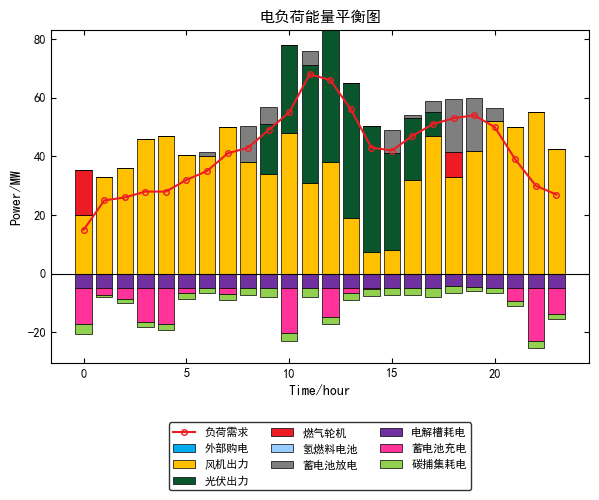 | 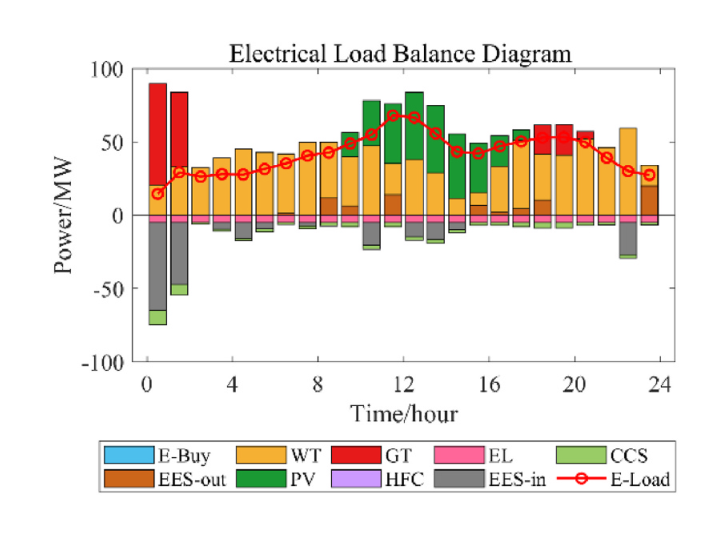 |

---

### 2. 热能量平衡对比

| 本项目复现结果 | 原论文结果 |
|---|---|
| 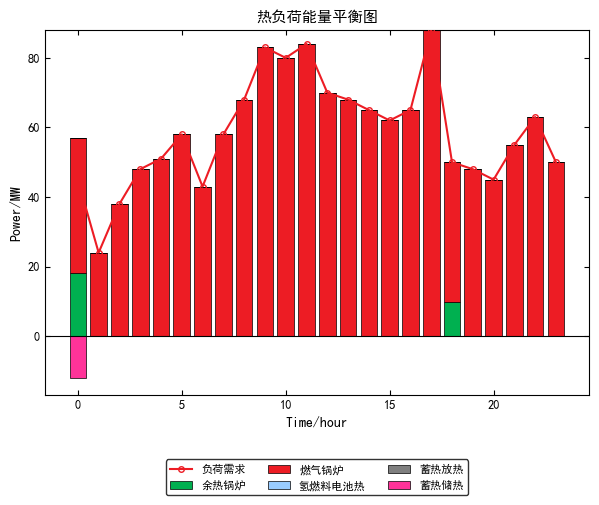 | 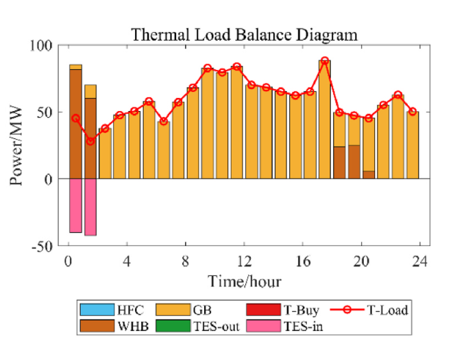 |

---

### 3. 天然气能量平衡对比

| 本项目复现结果 | 原论文结果 |
|---|---|
| 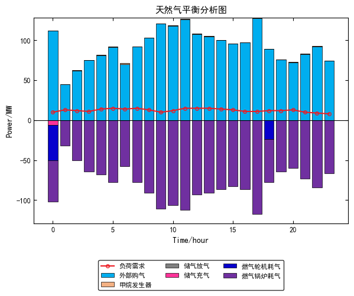 | 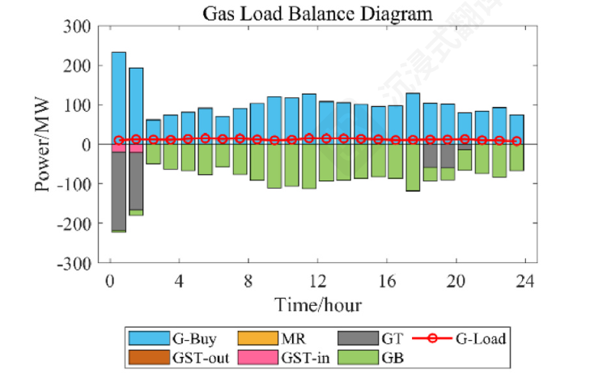 |

---

### 4. 氢能量平衡对比

| 本项目复现结果 | 原论文结果 |
|---|---|
| 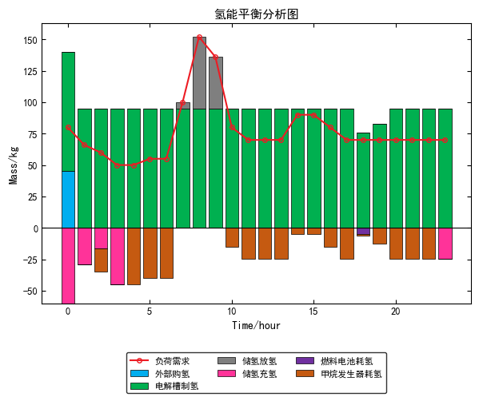 | 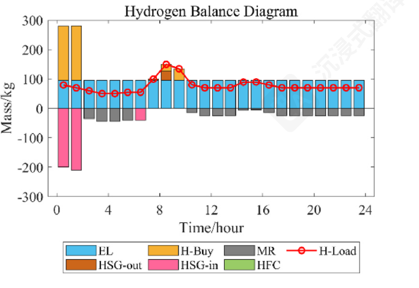 |

---

### 5. 碳捕获结果对比

| 本项目复现结果 | 原论文结果 |
|---|---|
| 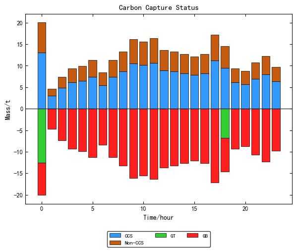 | 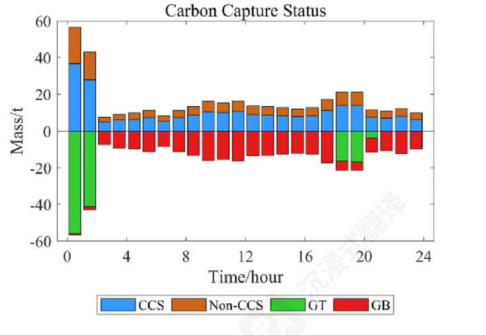 |

---

### 6. 碳储存结果对比

| 本项目复现结果 | 原论文结果 |
|---|---|
| 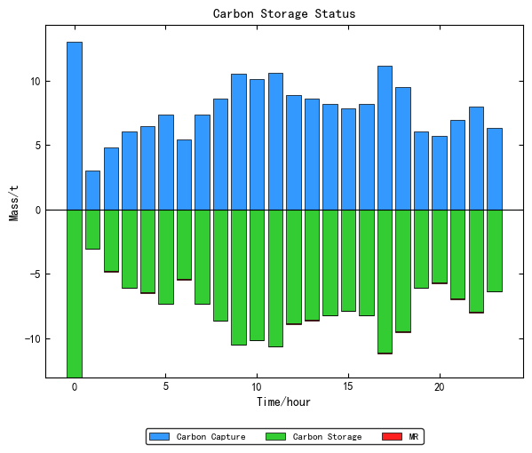 | 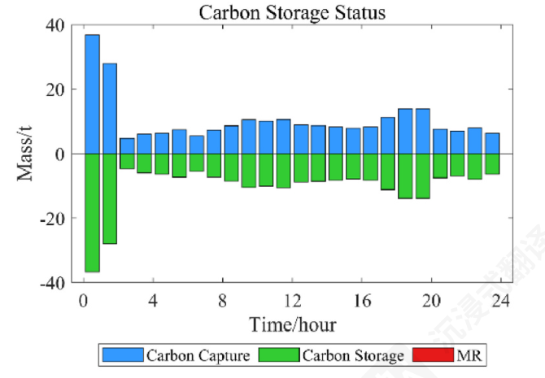 |

---

## 运行环境
```

如果尚未安装 Gurobi，请先完成 Gurobi 及许可证配置。

---

## 说明与声明

- 本项目仅用于 **学术研究与学习交流**
- 原论文图片仅用于复现效果对比展示
- 若在科研工作中使用本仓库代码，请 **务必引用原论文**
- 本项目为论文的非完美复现，因原论文储能边界约束存在求解冲突，已对储能相关约束做适配性调整，相关问题仍待优化解决

---

## 参考文献

[1] Wang J, Liu H, Xu C. Resource scheduling and capacity allocation optimization of an integrated electricity-heat-gas-hydrogen energy system[J]. Applied Energy, 2025.
